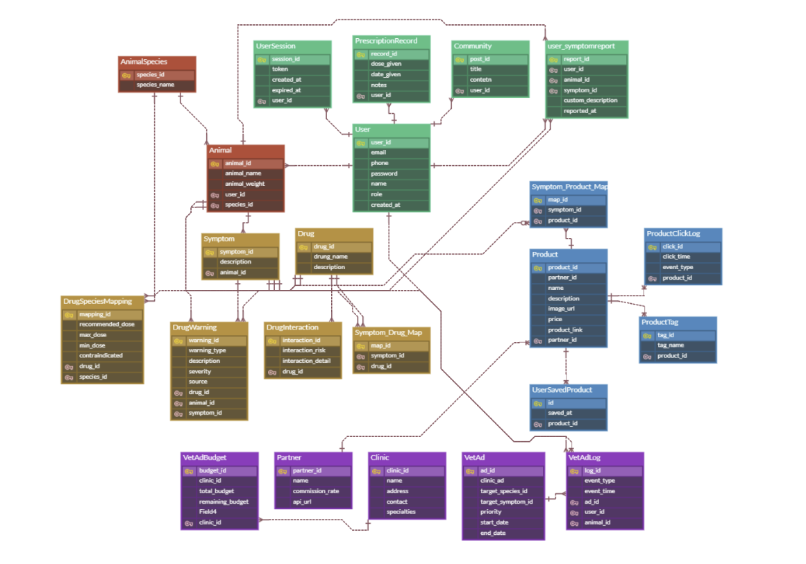

<p align="center">
  
</p>

<h1 align="center">🐾 <strong>AniMeds</strong></h1>
<p align="center"><em>Smart Medication for Pets</em></p>

<p align="center">
  반려동물 맞춤형 약물 추천 및 복약 관리 플랫폼  
  <br />
  <strong>동물의 건강을 위한 똑똑한 약물관리, AniMeds와 함께 하세요.</strong>
</p>

---

<p align="center">
  
</p>

## 📚 목차

- [👥 팀원 소개](#-팀원-소개)
- [🌟 프로젝트 개요](#-프로젝트-개요)
- [💡 개발 배경 및 필요성](#-개발-배경-및-필요성)
- [🔧 주요 기능](#-주요-기능)
- [📅 프로젝트 진행 일정 (WBS)](#-프로젝트-진행-일정-wbs)
- [📋 요구사항 명세](#-요구사항-명세)
  - [✅ 기능 요구사항](#-기능-요구사항)
  - [🚫 비기능 요구사항](#-비기능-요구사항)
- [🗂️ 데이터베이스 설계](#-데이터베이스-설계)
- [🧪 샘플 데이터 삽입 (DML)](#-샘플-데이터-삽입-dml)
- [🧠 저장 프로시저 예시](#-저장-프로시저-예시)
- [:speech_balloon: 시나리오](#-시나리오)
- [🎓 회고록](#-회고록)
- [🚀 기술 스택](#-기술-스택)
- [📁 프로젝트 구조](#-프로젝트-구조)
- [🐾 About AniMeds](#-about-animeds)

---

## 👥 팀원 소개

| <br>안진기     | <br>김민수              | <br>이승진 |   이원진 |  <br>최정우 |  <br>박채연 |
|----------|------------------|-----------|----|---|------|
| <p align="center">팀장</p> |<p align="center">팀원</p>| <p align="center">팀원</p>|<p align="center">팀원</p>|<p align="center">팀원</p>|<p align="center">팀원</p>|
| <p align="center"> <a href="https://github.com/Jinki-Ahn">  </a> |<p align="center"> <a href="https://github.com/minsu47722">  </a> </p> | <p align="center"> <a href="https://github.com/jintory">   </a> </p> | <p align="center"> <a href="https://github.com/sumgo-ssri">  </a> </p> | <p align="center">  <a href="https://github.com/JJJJungw">  </a> </p> | <p align="center">  <a href="https://github.com/pcochoco">   </a> </p> |

---

## 🌟 프로젝트 개요

**AniMeds**는 반려동물의 증상에 따른 약물 추천, 금기 정보 제공, 처방 이력 관리 및 커뮤니티를 통합한 플랫폼입니다.  
사용자에게 안전하고 정확한 반려동물 복약 환경을 제공하는 것을 목표로 합니다.

---

## 💡 개발 배경 및 필요성

## 📊 2017–2024년 대한민국 반려동물 양육 인구 비율 추이

2024년 농림축산식품부가 동물복지 국민의식조사를 실행한 바탕으로 약 28.6%에 달하는 국내 반려동물 양육인구 비율을 발표했습니다.
이는 그래프에서 확인할 수 있듯 매년 증가하는 추세입니다.
<p align="center">
  <a href="https://www.dailyvet.co.kr/news/policy/234742">
    
  </a>
</p>
또한 농림축산식품부는 국내 반려동물 시장을 2022년 기준 약 8.5조원으로 추산하고 2032년 약 21조원으로 예측했습니다.
<p align="center">
  <a href="https://www.dailyvet.co.kr/news/industry/214784">
    
  </a>
</p>


그러나 동일한 해 서울디지털재단이 해당 부 동물보호관리시스템에 등록된 데이터로 동물병원 현황을 분석한 결과를 바탕으로 서울시 기준 병원 1개소당 662마리의 반려견을 담당하고 있음을 확인할 수 있습니다.

이러한 점을 바탕으로 매년 증가하는 반려동물의 비율에 반해 부족한 의료시설과 그로 이어지는 적절한 치료와 처치의 공백이라는 문제를 발견했습니다. 

반려동물 양육자들이 증가함에 따라 반려동물 건강에 대한 관심 또한 상승했습니다. 그러나 값비싼 병원비로 인해 자가치료에 대한 의존도가 높습니다.
실제로 KB경영연구소가 작성한 ‘2025 한국 반려동물 보고서’에서는 2023년-2025년 반려동물 가구 평균 지출 치료비가 146.3만원이며 2년간 평균 37만원은 동물병원 밖에서 이루어지는 치료 금액으로 추정하고 있습니다. 

<p align="center">
  <a href="https://www.dailyvet.co.kr/news/practice/companion-animal/250748">
    
  </a>
</p>

[한정적인 동물 병원 진료 기록 공개](https://www.joongdo.co.kr/web/view.php?key=20250327010008570)와 병원비 상승 등으로 인해 반려동물의 치료에 대한 가격을 감당하기 힘든 양육자들의 차선책입니다. 그럼에도 불구하고 동물의 의료 기록 유지 기간이 짧고 병원별 비용이 격차가 있는 등 의료 체계가 사람에 비해 불명확함에 따라 양육자의 반려동물이 어떤 질환을 가지고 있는지와 그에 관한 처치의 범위에 대한 이해가 부족합니다.

질병과 관련한 지식이 없는 처치 행위는 특히나 약물 오남용 등 부작용으로 질병을 악화시키는 문제로 번질 수 있는 점에서 반려동물에 대한 적절한 치료 용도의 정보의 투명화와 통합적 제공이 필요합니다.


- ❌ 기존 정보는 흩어져 있고, 종에 따라 금기 약물 정보가 명확하지 않음  
- 🐶 사용자 맞춤형 복약 정보 필요 (나이/종/체중에 따라)
- 💬 보호자 간 소통 채널 부족 → 커뮤니티 필요  
- 📢 병원과 제품 광고도 관리 가능한 통합 플랫폼 필요

---

## 🔧 주요 기능

<!-- 상단 3개 -->
<table align="center">
  <tr align="center">
    <td>
      <br/>
      <strong>사용자/동물 등록</strong>
    </td>
    <td style="width: 80px;"></td> <!-- 간격 -->
    <td>
      <br/>
      <strong>증상 기반 약 추천</strong>
    </td>
    <td style="width: 80px;"></td>
    <td>
      <br/>
      <strong>복약 이력 관리</strong>
    </td>
  </tr>
</table>

<br/>

<!-- 하단 4개 -->
<table align="center">
  <tr align="center">
    <td>
      <br/>
      <strong>약물 상호작용</strong>
    </td>
    <td style="width: 60px;"></td>
    <td>
      <br/>
      <strong>병원 광고 노출</strong>
    </td>
    <td style="width: 60px;"></td>
    <td>
      <br/>
      <strong>커뮤니티</strong>
    </td>
    <td style="width: 60px;"></td>
    <td>
      <br/>
      <strong>제휴 상품 추적</strong>
    </td>
  </tr>
</table>

---

## 📅 프로젝트 진행 일정 (WBS)


[프로젝트 진행 일정(wbs)](https://docs.google.com/spreadsheets/d/1220bBuBJ12cd4qBncc2iErHQUT1RVwtTA3J0CJ5_gtg/edit?gid=0#gid=0)

---

## 📋 요구사항 명세

## 🧾 요구사항 정의서


 [요구사항 정의서](https://docs.google.com/spreadsheets/d/1ezIGvaFNwkBmDPlIIaDlnmjDzN0-As8Hf1kQjH_DhoM/edit?gid=0#gid=0)

## ✅ 기능 요구사항
- 사용자 계정 CRUD
- 동물 등록 및 정보 조회
- 증상 기반 약물 추천 (금기, 권장용량 고려)
- 사용자 처방 기록 저장
- 커뮤니티 글 작성 및 열람
- 병원 광고 노출 및 클릭 이벤트 추적
--
## 🚫 비기능 요구사항
- 인증 토큰 기반 세션 관리 (JWT 등)
- 인덱스를 활용한 검색 성능 최적화
- 반응형 UI 지원 (모바일/PC)
- 데이터 무결성 보장 (외래키, 제약조건 등)

---

## 🗂️ 데이터베이스 설계

### ERD
<p align="center">
  
</p>


### Schema DDL


## 🧪 샘플 데이터 삽입 (DML)

- [data/sample_data.sql](data/sample_data.sql)  
- 총 100건의 더미 데이터 삽입: `User`, `Animal`, `Symptom`, `Drug` 등
- 삽입 순서: User → Species → Animal → Symptom → Drug → Mapping

---

## 🧠 저장 프로시저 예시

```sql
DELIMITER $$
CREATE PROCEDURE RecommendDrugBySymptom (
    IN in_symptom_id INT,
    IN in_species_id INT
)
BEGIN
    SELECT d.drug_id, d.drug_name, m.recommended_dose
    FROM Drug d
    JOIN DrugSpeciesMapping m ON d.drug_id = m.drug_id
    JOIN Symptom_Drug_Map sdm ON d.drug_id = sdm.drug_id
    WHERE sdm.symptom_id = in_symptom_id
      AND m.species_id = in_species_id
      AND m.contraindicated = FALSE;
END$$
DELIMITER ;
```
---
## :speech_balloon: 시나리오


---
<details> 
<summary>클릭해서 열기</summary>

여기에 들어갈 숨겨진 내용입니다.  
여러 줄도 쓸 수 있고, 마크다운 문법도 정상 작동합니다.  
- 리스트
- 굵게: **텍스트**
- 코드 블록:
```sql
SELECT * FROM Drug;
```
</details>

<details>
<summary>앨범 좋아요 누르기 기능</summary>
<div markdown="1">


```SQL
    DELIMITER $$
    CREATE OR REPLACE PROCEDURE member_add_album_like(
    	IN uid BIGINT (20),
    	IN a_id BIGINT (20)
    )
    BEGIN 
    	IF NOT EXISTS (
    		SELECT *
    		FROM like_cnt
    		WHERE member_id = uid AND album_id = a_id
    	) 
    	THEN
    		INSERT INTO like_cnt(member_id, album_id) VALUES (uid, a_id);
    	ELSE
    		SIGNAL SQLSTATE '45000' SET MESSAGE_TEXT =  '이미 좋아요를 누른 곡입니다.';
    	END IF;
    END $$
    DELIMITER ;
```

</div>
</details>

🎓 회고록
팀원	회고 내용

🚀 기술 스택
DB: Maria db

📌 프로젝트 구조

🐾 About AniMeds
## 🐾 About AniMeds

---

> 반려동물의 건강과 행복을 위하여  
> **AniMeds**는 약물 추천을 넘어 예방, 치료, 정보 공유까지 지원하는  
> 반려동물 통합 관리 플랫폼입니다.
